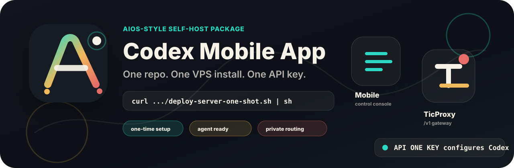
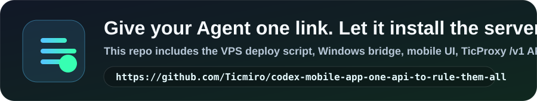
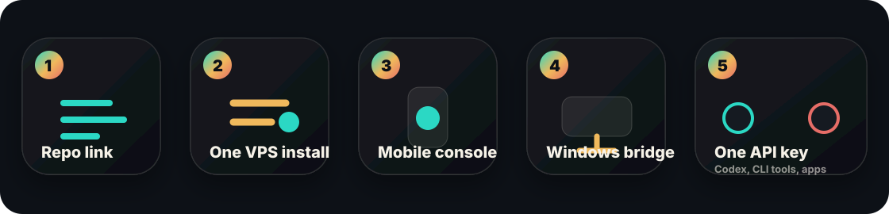
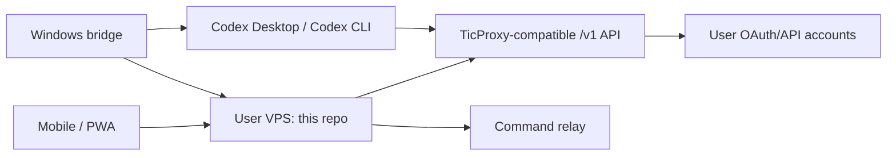

# Codex Mobile App - One API to rule them All



Self-host your own TicProxy server, Codex Mobile relay, Windows bridge, and OpenAI-compatible `/v1` endpoint from one repo. Install it once on your VPS, connect the Windows PC that owns Codex Desktop, then use one proxy API key across Codex, CLI tools, mobile workflows, and compatible apps.

[](docs/AGENT_INSTALL.md)

## Install once, use everywhere



This repo is built for a simple handoff:

1. Point a domain to your VPS.
2. Run the one-shot server installer.
3. Open the mobile console with the printed mobile token.
4. Install the Windows bridge on the PC running Codex Desktop.
5. Add OAuth/API accounts in TicProxy.
6. Press `API ONE KEY` to configure Codex Desktop through the bridge.
7. Use the same `/v1` base URL and proxy API key from any supported client.

No managed proxy endpoint is required. Each install owns its tokens, account pool, quota view, routing rules, and Codex Desktop bridge.

## What you get

| Surface | What it does |
| --- | --- |
| `TicProxy /v1` | OpenAI-compatible proxy route across many accounts, providers, models, and quota states. |
| `Codex Mobile` | Browser/mobile console for Codex thread sync, TicProxy management, OAuth, auth files, quota, logs, and provider info. |
| `Windows bridge` | Outbound-only local agent that connects the user's Codex Desktop/Codex CLI state to the self-hosted server. |
| `API ONE KEY` | Bridge action that writes the TicProxy provider into local Codex config so the user can switch once and keep working. |
| `Agent install docs` | A ready prompt for another AI/server agent: give it the repo link and let it install the VPS side safely. |

## Agent-ready server handoff

If another agent will install the server for you, send only this repo link and the prompt in [`docs/AGENT_INSTALL.md`](docs/AGENT_INSTALL.md):

```text
https://github.com/Ticmiro/codex-mobile-app-one-api-to-rule-them-all
```

The agent prompt tells it to install once, keep secrets private, verify `/health`, preserve server data, and hand back the Mobile URL, Windows bridge token, Proxy API key, and update command.

## Login and provider status

OAuth URL generation is built in for `Codex / ChatGPT`, using the CLI-style local callback URL and PKCE. The Windows bridge includes a local callback relay, so when the login link is opened on the PC running the bridge, the final localhost callback is submitted back to the VPS automatically.

`Gemini CLI` and `Antigravity` presets are present too, but their Google OAuth client values must be supplied through environment variables or `data/providers.json` because GitHub push protection blocks shipping those client credentials in a public repo. Custom providers can still use the generic Authorization Code + PKCE adapter.

## Architecture



## Components

- `apps/server`: VPS server with static mobile UI, relay endpoints, admin endpoints, OAuth callback, and OpenAI-compatible `/v1`.
- `apps/mobile-web`: mobile-first product console with Codex Chat Mobile, PC Agent, Auther Platforms, provider setup, OAuth/API-key account login, quota/routing, and install info.
- `apps/windows-bridge`: Windows-side bridge that connects local Codex Desktop/Codex CLI state to the user's VPS, syncs Desktop thread transcripts from `CODEX_HOME/sessions`, and can run queued `codex.exec` or selected-thread sends from the mobile Agent/Chat tabs.
- `scripts/deploy-server-one-shot.sh`: one-command VPS deployment.
- `scripts/install-windows-bridge.ps1`: one-command Windows bridge setup.

## Quick Start: VPS

`DOMAIN=codex.example.com` must be your real domain or subdomain. Create a DNS `A` record that points that name to your VPS public IPv4 address first, for example:

```text
codex.example.com  A  203.0.113.10
```

After DNS points to the VPS, install on an Ubuntu/Debian server:

```bash
export DOMAIN=codex.example.com
curl -fsSL https://raw.githubusercontent.com/Ticmiro/codex-mobile-app-one-api-to-rule-them-all/main/scripts/deploy-server-one-shot.sh | sh
```

The script prints four important values:

- Mobile token
- Windows bridge token
- Admin token
- Proxy API key for Codex

When `DOMAIN` is set, the deploy script also installs Caddy and writes `/etc/caddy/Caddyfile` automatically on Ubuntu/Debian. The generated reverse proxy is:

```caddy
codex.example.com {
  reverse_proxy 127.0.0.1:4899
}
```

`127.0.0.1` here means "this VPS itself." It is correct because Docker publishes the app only to the VPS loopback interface. Public traffic should go:

```text
phone/browser -> https://codex.example.com -> Caddy on VPS -> 127.0.0.1:4899
```

After the script finishes, test the public route with `curl https://codex.example.com/health`.

Set `INSTALL_CADDY=0` before running the deploy script only if you want to manage Caddy/Nginx yourself.

To update an existing VPS without changing tokens:

```bash
cd /opt/codex-mobile-app-one-api-to-rule-them-all
git pull --ff-only
docker compose up -d --build
```

If you rerun the one-shot deploy script, it now reuses the existing `.env` token values when present.

For a slower, beginner-friendly explanation of domain, DNS, HTTPS, and copy-paste install commands, read [`docs/DOMAIN_DNS_GUIDE.md`](docs/DOMAIN_DNS_GUIDE.md).

If the container starts but the public URL does not connect, read [`docs/SERVER_TROUBLESHOOTING.md`](docs/SERVER_TROUBLESHOOTING.md).

## Quick Start: Windows Bridge

On the Windows PC that runs Codex Desktop, do not copy only `install-windows-bridge.ps1` into an empty folder. The installer needs the whole repo because it calls:

- `scripts/start-windows-bridge.ps1`
- `apps/windows-bridge/src/index.js`

Requirement: install Node.js 22 LTS first if `node -v` does not work:

```powershell
winget install OpenJS.NodeJS.LTS
```

Also install or verify Codex CLI on this Windows PC. The bridge needs local `codex exec` and `codex app-server` for PC Agent and selected-thread send:

```powershell
npm i -g @openai/codex
codex --version
codex app-server --help
```

If Codex Desktop already bundles a real `codex.exe`, the installer will try to detect it and write `TICMIRO_CODEX_BIN` automatically.

Beginner option: run the bootstrap script from GitHub. It downloads the full repo to `%USERPROFILE%\codex-mobile-app-one-api-to-rule-them-all`, then runs the real installer:

```powershell
$Bootstrap = "$env:TEMP\ticproxy-bootstrap-windows-bridge.ps1"
Invoke-WebRequest `
  -Uri "https://raw.githubusercontent.com/Ticmiro/codex-mobile-app-one-api-to-rule-them-all/main/scripts/bootstrap-windows-bridge.ps1" `
  -OutFile $Bootstrap
powershell -ExecutionPolicy Bypass -File $Bootstrap -RunNow
```

Developer option: clone the repo, then run the installer:

```powershell
git clone https://github.com/Ticmiro/codex-mobile-app-one-api-to-rule-them-all.git
cd codex-mobile-app-one-api-to-rule-them-all
powershell -ExecutionPolicy Bypass -File .\scripts\install-windows-bridge.ps1 -RunNow
```

If you already have this repo on disk, open PowerShell in the repo root and run:

```powershell
powershell -ExecutionPolicy Bypass -File .\scripts\install-windows-bridge.ps1 -RunNow
```

The installer asks for:

- Your server URL, for example `https://codex.example.com`
- Windows bridge token
- Proxy API key
- Codex home folder
- Allowed folders

It writes `.env.local`, installs a Scheduled Task, and starts the bridge.

Full A-Z mobile/Desktop setup guide: [`docs/CODEX_MOBILE_DESKTOP_A_TO_Z.md`](docs/CODEX_MOBILE_DESKTOP_A_TO_Z.md).

## Configure Codex

Set Codex/TicProxy provider to:

```env
TICPROXY_BASE_URL=https://codex.example.com/v1
TICPROXY_API_KEY=<proxy-api-key-from-server-install>
```

The Windows bridge installer writes these values to `.env.local`. Your Codex provider config should point to the same base URL and env key.

For current Codex Desktop builds, the TicProxy provider in `config.toml` must use:

```toml
wire_api = "responses"
```

Do not use the old `wire_api = "chat"` value; Codex will fail to load configuration and the Desktop chat cannot continue.

## Ticmiro Mobile UI

After VPS install, open your domain with the printed `Mobile token`:

```text
https://codex.example.com/?token=<mobile-token-from-installer>
```

The browser UI opens directly into the TicProxy control surface. New users do not need to choose a workbench template.

The app has three main areas:

- `Codex Chat`: read synced Codex Desktop threads and send a message into the selected thread through the Windows bridge.
- `TicProxy`: manage the proxy surface: OAuth login, imported auth JSON, quota, providers, config, logs, and `/v1` info.
- `Agent PC`: check the Windows bridge, command queue, allowed folders, file controls, task status, `codex exec`, and run a real TicProxy `/v1/responses` connection test against auto route or a chosen account.

Token roles after install:

- `Mobile token`: opens and controls the mobile UI.
- `Windows bridge token`: used only by the Windows bridge `.env.local`.
- `Proxy API key`: paste into Codex/Gemini/Antigravity/OpenAI-compatible clients that call `https://codex.example.com/v1`.
- `Admin token`: for advanced admin API calls such as `/admin/providers` and `/admin/accounts`; the beginner UI keeps this out of the way.

Beginner guide: [`docs/APP_AUTHER_SETUP.md`](docs/APP_AUTHER_SETUP.md). Codex Desktop conversation sync guide: [`docs/CODEX_CHAT_SYNC.md`](docs/CODEX_CHAT_SYNC.md). Full A-Z setup: [`docs/CODEX_MOBILE_DESKTOP_A_TO_Z.md`](docs/CODEX_MOBILE_DESKTOP_A_TO_Z.md).

Recommended first test: open `TicProxy -> OAuth`, choose `Codex / ChatGPT`, then press `Tao link dang nhap`. Open the link on the Windows PC that is running the bridge. A fresh install should create an OpenAI/Codex auth URL immediately, and the bridge should auto-submit the localhost callback after login. If the browser lands on a local callback page and does not close, open `Nhap callback thu cong`, copy the full `localhost` URL with `code=...&state=...`, paste it, and press `Submit`.

Then open `TicProxy -> Info`, confirm the base URL is `https://your-domain/v1`, and configure Codex Desktop with the printed `Proxy API key`. For custom providers, fill the provider OAuth values in `data/providers.json` or import trusted auth JSON in `TicProxy -> Auth Files`.

For a second Windows PC that already has Codex installed, hand the local Codex agent this repair/handoff file so it can diagnose the machine, repair the bridge, and update `config.toml`: [`docs/CODEX_DESKTOP_AGENT_REPAIR.md`](docs/CODEX_DESKTOP_AGENT_REPAIR.md).

## Auther/OAuth API

Provider OAuth and account routing are configured in `data/providers.json` on the server. The server has the Auther layer needed for TicProxy account management:

- `POST /admin/oauth/start` starts provider login with Authorization Code + PKCE adapter settings.
- `GET /admin/codex-auth-url`, `/admin/gemini-cli-auth-url`, and `/admin/antigravity-auth-url` provide provider auth URL aliases for configured platform providers.
- `GET /admin/oauth/status` and `/admin/get-auth-status` expose login status polling for the web UI or local helpers.
- `POST /admin/oauth-callback` and `/oauth-callback` accept local relay `{provider, redirect_url}` callback payloads and return JSON confirmation after saving the account.
- `POST /agent/oauth-callback` lets the Windows bridge submit a local browser callback using only the bridge token.
- `GET /oauth/callback` exchanges the code, fetches profile metadata when configured, and saves an account.
- `POST /admin/accounts` adds API-key accounts for providers that are not OAuth based.
- `POST /admin/auth-files` imports trusted local auth/token JSON into the account pool; `GET /admin/auth-files` lists imported auth file metadata without exposing tokens.
- `POST /admin/accounts/:id/refresh` refreshes OAuth accounts manually; proxy calls refresh automatically before expiry.
- `/v1/*` routes each request across active accounts by model allowlist, priority, account strategy, and daily quota.
- `GET /admin/usage` reports provider, account, and proxy-key counters.

The exact provider adapter values still depend on the target service. This repo intentionally keeps the adapter layer clean-room and open-source.

## Codex Desktop Thread Sync

Codex Chat Mobile does not sync Desktop conversations by itself. Sync is handled by the Windows bridge because only that PC can read the local Codex Desktop data folder.

The bridge publishes:

- recent threads from `CODEX_HOME/sessions/**/*.jsonl`
- recent transcript messages per thread
- `codex.thread.send` support, which uses Codex app-server JSON-RPC `thread/resume` plus `turn/start` to send into the selected Desktop thread when the local Codex runtime supports it

This is separate from `codex.exec`: `codex.exec` starts an independent CLI task, while `Desktop Thread Sync` targets an existing Desktop thread.

Detailed sync guide: [`docs/CODEX_CHAT_SYNC.md`](docs/CODEX_CHAT_SYNC.md).

## Development

```bash
npm run check
npm run server:start
```

## Security Defaults

- VPS stores provider/account tokens in `data/providers.json`; protect the server.
- VPS stores the latest bridge snapshot in `data/state.json`; when Desktop thread sync is enabled, recent transcript snippets are included there.
- Mobile token, agent token, admin token, and proxy API key must differ in production.
- Windows bridge only connects outbound to the user's server.
- File/system actions should be added behind explicit allowed roots and approval gates.

## License

MIT. See `LICENSE`.
